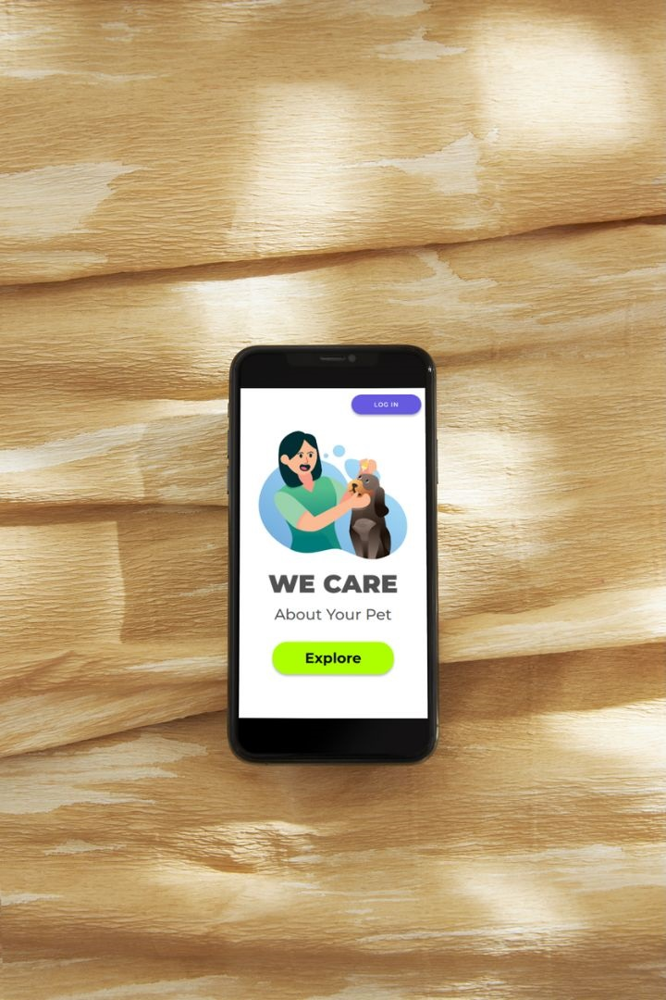
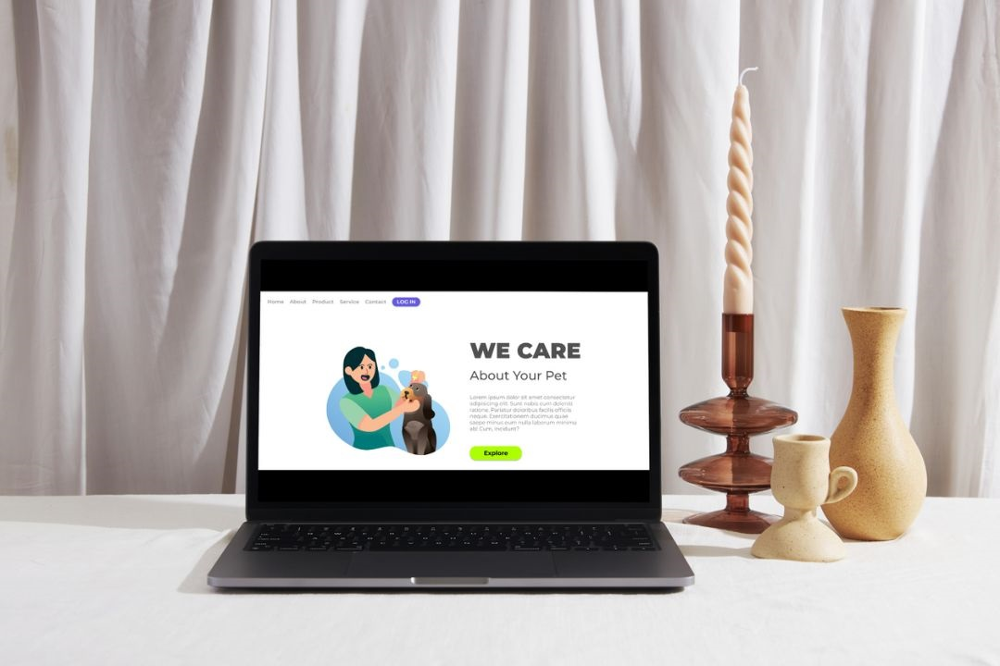

<h1>Project We Care</h1>

<h2>We Care is a responsive HTML and CSS project that demonstrates functional links, buttons, formatted text, and precise element positioning. It showcases seamless design adaptability as the page transforms with varying screen resolutions.</h2>

## Features

- Responsive design with HTML and CSS.
- Functional links and buttons.
- Formatted text for improved readability.
- Precise element positioning for a polished user experience.

## Technologies Used

- 
- 

## Preview and Link

[Link to Live Demo](https://jhschier.github.io/Project-We-Care/)

## About

"We Care" is a project highlighting the capabilities of HTML and CSS in creating responsive and visually appealing web pages. It emphasizes the importance of design adaptability to provide an optimal user experience across different devices.
